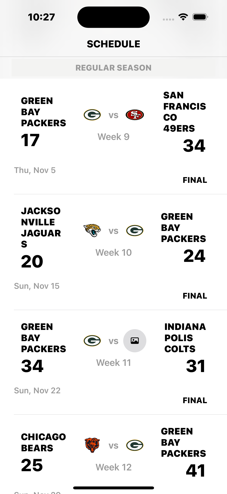

# KickoffClock

Welcome to **KickoffClock**!  
This iOS app is your go-to solution for viewing a sports team's schedule, complete with game details, scores, and team logos—all built with modern SwiftUI and best practices in mind.

---

## 📱 Preview

> 

---

## ✨ Features

- **Clean Schedule List:** Browse all games, organized by section.
- **Game Details:** Instantly see home/away teams, scores, dates, and game status.
- **Team Logos:** Logos load asynchronously and are cached for smooth performance.
- **Protocol-Oriented Networking:** Easily test and extend the app's data layer.
- **SwiftUI & MVVM:** Modern, maintainable, and scalable architecture.
- **Async/Await:** Fast, non-blocking data loading for a responsive UI.

---

## 🗂 Project Structure

```
KickoffClock/
├── Screenshots/         # App screenshots for README
├── Cache/               # Caching utilities
├── Models/              # Data models
├── Services/            # Networking and data services (ScheduleService)
├── ViewModels/          # Observable view models (ScheduleViewModel)
├── UIComponents/        # Reusable SwiftUI views (TeamLogoView, etc.)
├── Utils/               # Constants, URLs
├── ContentView.swift    # Main app view
├── KickoffClockApp.swift
├── Assets/              # Asset catalog (images, colors, etc.)
├── Info/                # Info.plist and related files
├── Preview Content/     # SwiftUI preview assets
├── KickoffClockTests/   # Unit tests
└── KickoffClockUITests/ # UI tests
```

---

## 🚀 Getting Started

1. **Clone the repository:**

   ```sh
   git clone https://github.com/toto1949/KickoffClock.git
   cd KickoffClock
   ```

2. **Open in Xcode:**

   - Open `KickoffClock.xcodeproj` or `KickoffClock.xcworkspace`.

3. **Build & Run:**
   - Select a simulator or device.
   - Press ⌘R to build and run.

---

## 🔑 Key Files

- `Models/Game.swift` — Codable models and protocol conformance.
- `ViewModels/ScheduleViewModel.swift` — Fetches and publishes schedule data.
- `Services/ScheduleService.swift` — Async/await networking, protocol-oriented.
- `Utils/URLs.swift` — Centralized URLs for API endpoints and team logos.
- `UIComponents/TeamLogoView.swift` — Async image loading and caching.

---

## 🌐 Networking

- **Schedule:**  
  `http://files.yinzcam.com/iOS/interviews/ScheduleExercise/schedule.json`
- **Team Logos:**  
  `https://resources-us.yinzcam.com/nfl/logos/nfl_{triCode}_light.png`

---

## 🏗 Architecture & Best Practices

- **MVVM:** Clear separation of data, business logic, and UI.
- **Protocol-Oriented:** Services use protocols for easy mocking/testing.
- **Async/Await:** Networking is non-blocking and main-thread safe.
- **Memory Safety:** Uses `[weak self]` in async closures to avoid retain cycles.
- **No Duplicates:** Codebase is scanned and cleaned for unnecessary code and duplicates.

---

## 🎨 Customization

- **Change Team:** The root team is loaded from the schedule JSON.
- **UI Constants:** Adjust fonts, colors, and paddings in `Utils/UIConstants.swift`.

---

